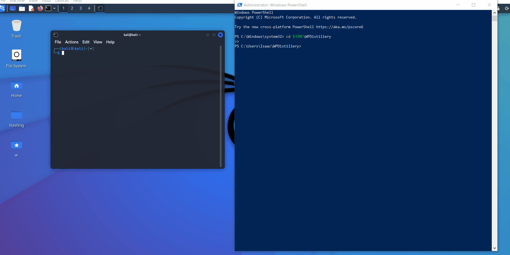

# WordPress-vs.-Kali
# Project 7 - WordPress Pen Testing

Time spent: 5 hours spent in total

## Notes

I was successfully able to follow the steps up to Lab 2 Part 2, but then I was no longer able to access the WordPress website on my browser after following "Open the Hole" step. I tried to search online to attempt to fix it, but couldn't find anything useful. I also went to office hours and after attempting to fix with the TA (Jackie Friedberg), but we couldn't. We made sure that the website was up by pinging both on PowerShell and Kali Terminal, we also tried restarting the device, but we still couldn't get it working.

Below is the error I have seen:

## License

    Copyright [2022] [Patrick Lin]

    Licensed under the Apache License, Version 2.0 (the "License");
    you may not use this file except in compliance with the License.
    You may obtain a copy of the License at

        http://www.apache.org/licenses/LICENSE-2.0

    Unless required by applicable law or agreed to in writing, software
    distributed under the License is distributed on an "AS IS" BASIS,
    WITHOUT WARRANTIES OR CONDITIONS OF ANY KIND, either express or implied.
    See the License for the specific language governing permissions and
    limitations under the License.
